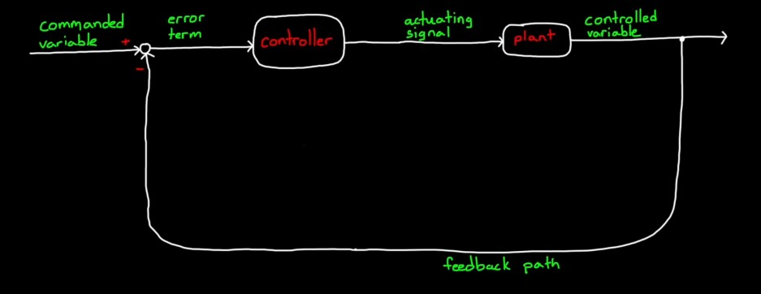

# Overview

## Basic Diagram

## Vocabulary

**Plant**: System we want to control

**Actuating Signal**: input into plant

**Controlled Variable**: output of the plant

**Commanded Variable**: Desired output of the plant

**Feedback Path**: output of the system is fed back and compared to command

**Error Term**: Difference between Controlled and Commanded Variable (Desired Value is 0)

**PID Controller**: Controller used to combat error term and drive it to 0

## PID Meaning

### Proportion

* Used to reach an error term of 0 by multiplication of a constant factor
* Gives a magnitude to combat error and approach commanded variable
* In many cases solely a proportional controller works
* Sometimes leaves an error (known as steady state error) which requires the use of an integrator

### Integral

* Used to combat steady state error
* Keeps track of past information and has a memory of sorts
* Its job is to combat the error by summing the past errors
* A steady state error is a non zero constant value, and when that is integrated, a linear term appears for the integrator
* Once a steady state error is reached, the proportional path does nothing
* The path may cause oscillation, which requires the use of a derivative path

### Derivative

* Used to combat oscillation
* Measures the rate of change of the error and determines how we are approaching the goal
* Prematurely alters the rate of change to prevent overshooting
